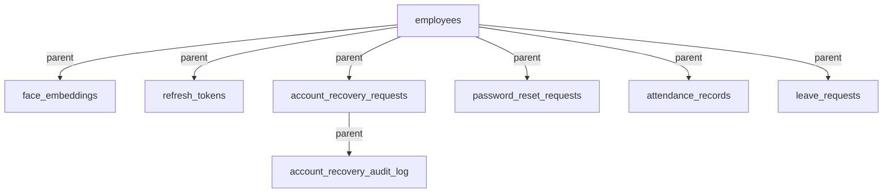

# DATABASE DEPENDENCY ANALYSIS

This document outlines the table relationships, foreign key constraints, and categorization of records in the `attendance_system` database as mandated by the V12 Forensic Protocol.

## 1. Schema Classification

To ensure a safe selective reset, database tables are categorized based on their roles and dependency lifetimes:

### 1.1. System-Critical Tables (Protected)
These tables contain core business configurations, permissions, and identity data. Wiping them would break basic system behavior.
- `employees`: Stores user profiles (admin, supervisor, employee).
- `administrators`: Tracks admin status.
- `role_assignments` & `role_permissions`: Controls system access controls.
- `admin_configuration`: Defines initial system setup flags.
- `schema_migrations`: Tracks applied database migrations.

### 1.2. Operational Data Tables (Protected)
These tables store active records that must survive cleanups according to company retention policies.
- `face_embeddings`: Stores biometric embeddings mapped to employees.
- `attendance_records`: Log check-ins and check-outs.
- `leave_requests` & `leave_approval_history`: Manages leave request lifecycles.
- `work_reports` & `work_timings`: Tracks employee output.

### 1.3. Transient Tables (Targets for Selective Reset)
These tables store temporary codes, short-lived tokens, or security audit trails that can be cleaned up without affecting user profiles or attendance data.
- `refresh_tokens`: Active user sessions.
- `account_recovery_requests`: Transient password/face reset requests containing OTP hashes.
- `password_reset_requests`: Password reset requests awaiting action.
- `notifications`: Temporary alert logs.

---

## 2. Foreign Key Constraint Mapping

The database schema relies heavily on referential integrity. Deletions must occur in the correct order to avoid constraint violations:

- **`employees`**: Root table. Any cascade delete on employees is blocked on critical child records unless Cascade configuration is explicit.
- **`face_embeddings`**: References `employees(id)`.
- **`refresh_tokens`**: References `employees(id)` with `ON DELETE CASCADE`.
- **`account_recovery_requests`**: References `employees(id)` with `ON DELETE RESTRICT`. Requires deleting entries in `account_recovery_audit_log` first.
