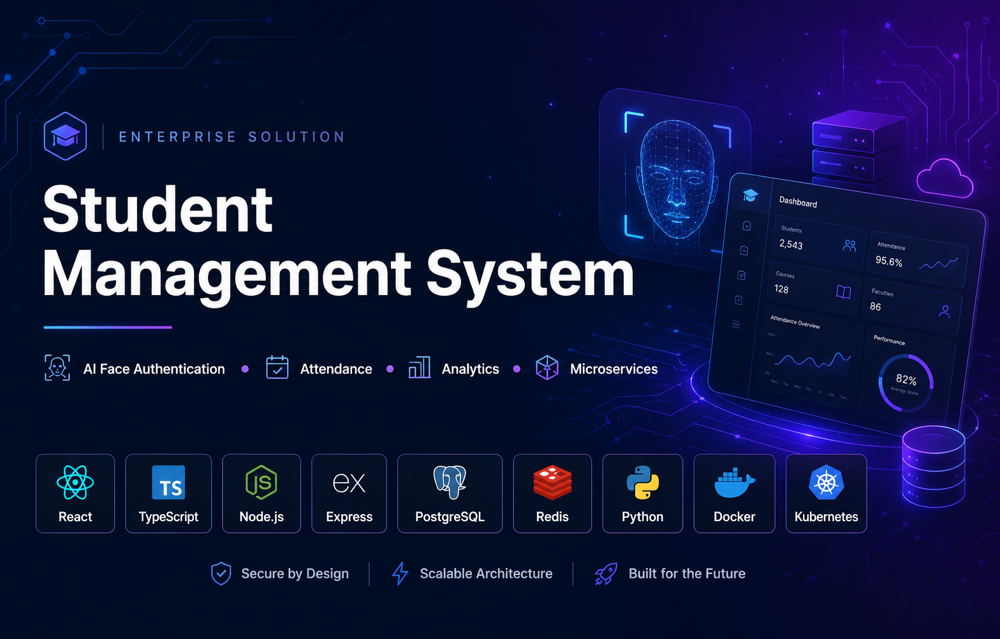
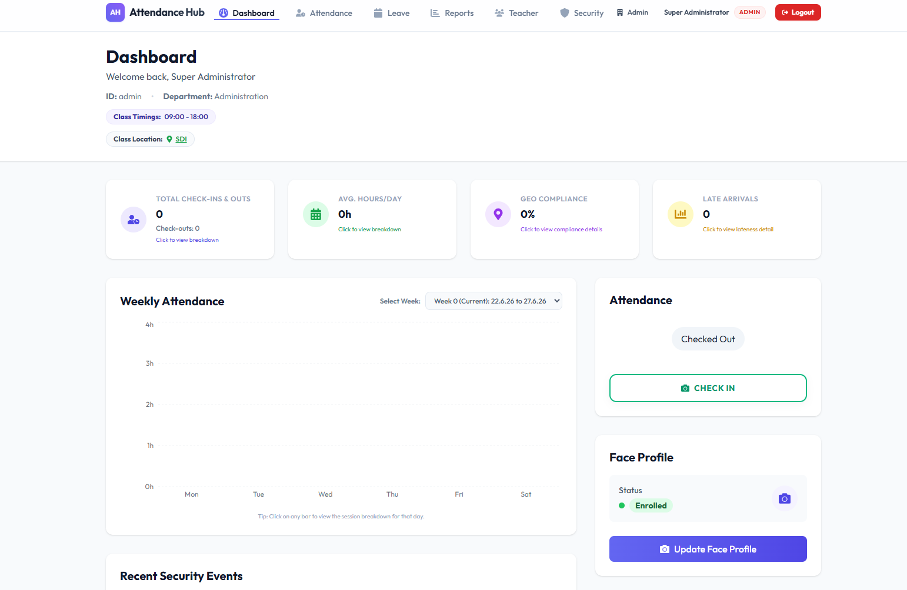
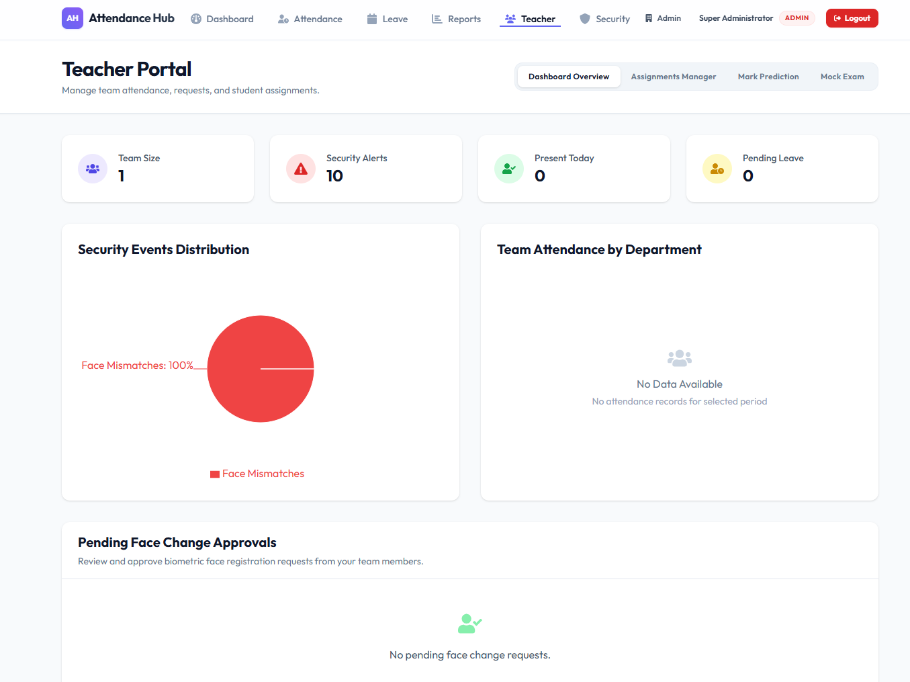
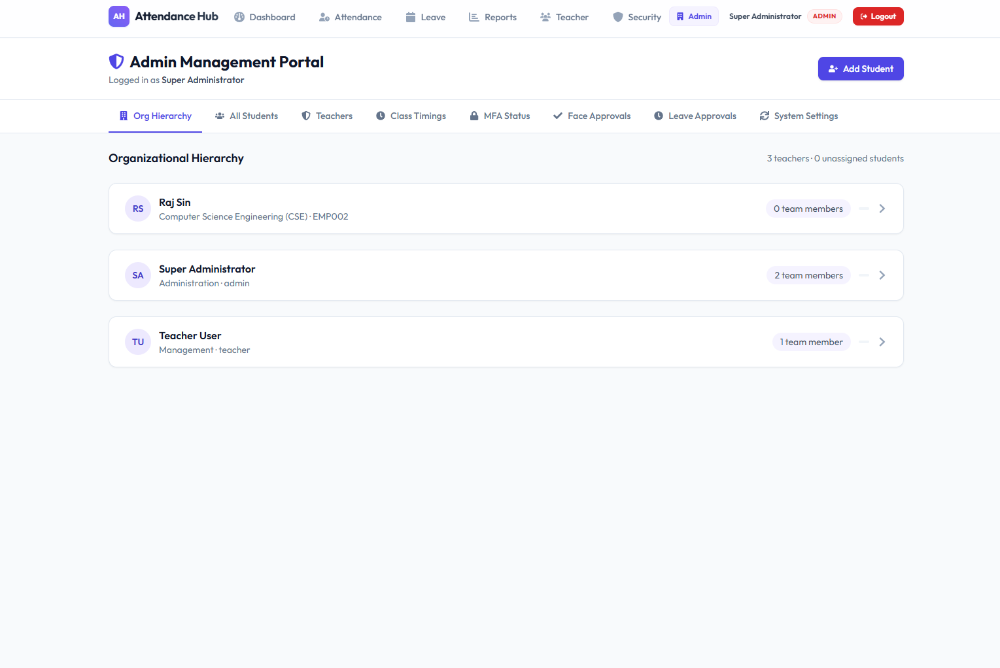
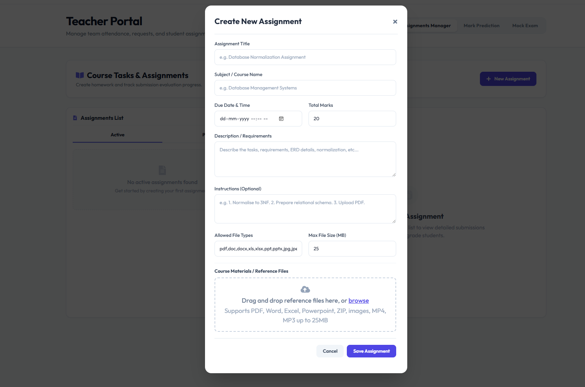
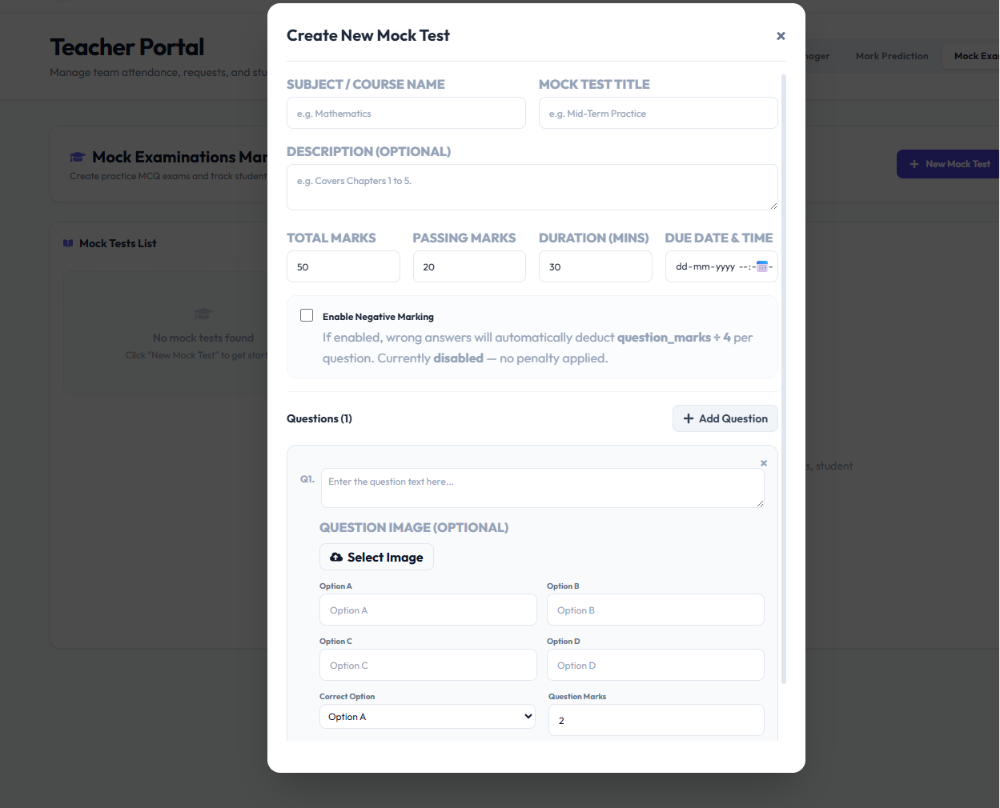
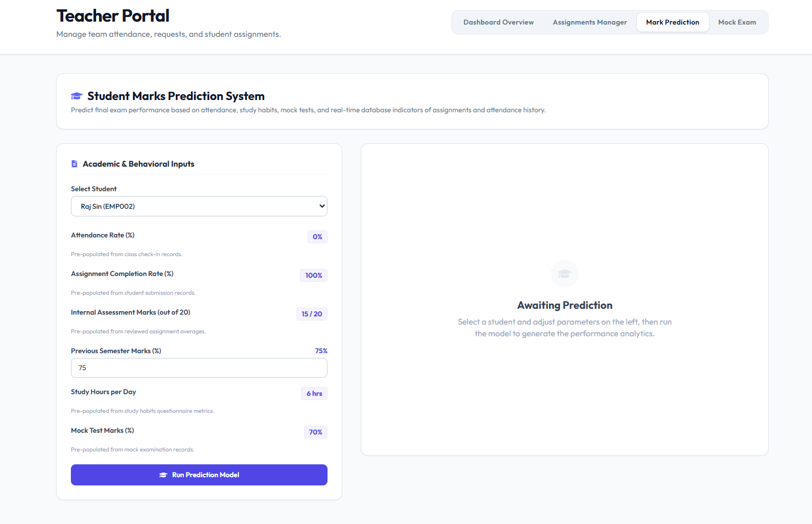
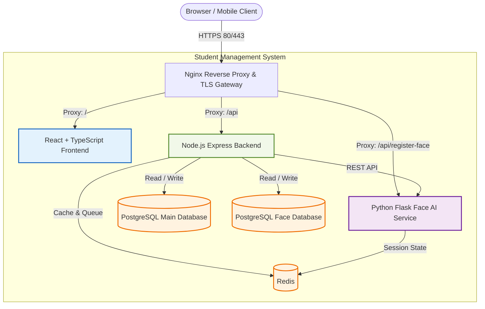
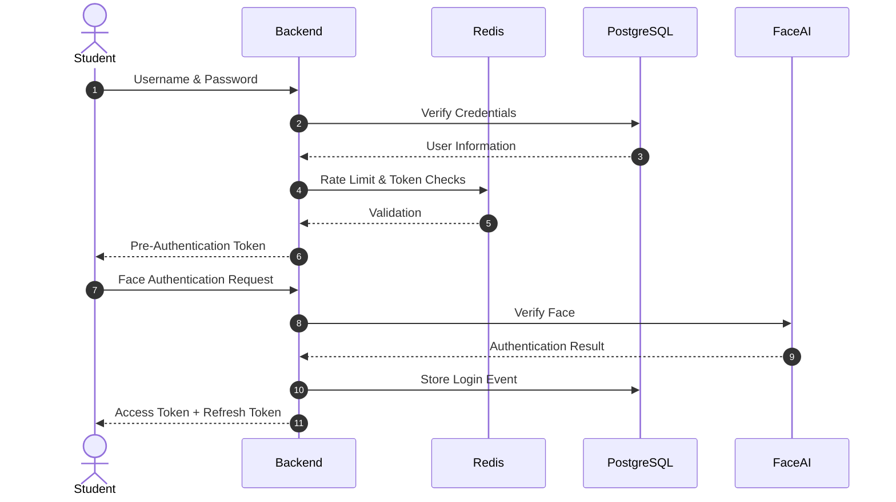
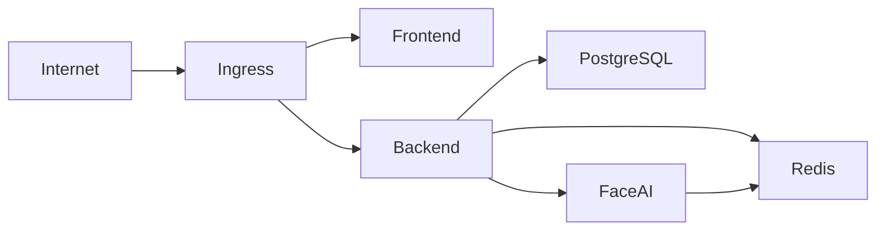

# 🎓 Student Management System

<p align="center">
  
</p>

<p align="center">
  <strong>A Modern AI-Powered Student Management Platform with Face Authentication, Attendance, Academic Analytics, Assignments, Mock Examinations, and Microservices Architecture.</strong>
</p>

<p align="center">

<a href="#-project-overview">Overview</a> • <a href="#-highlights">Highlights</a> • <a href="#-architecture-diagram">Architecture</a> • <a href="#-screenshots">Screenshots</a> • <a href="#-installation-guide--local-development">Installation</a> • <a href="#-docker-deployment-details">Docker</a> • <a href="#-kubernetes-deployment-overview">Kubernetes</a> • <a href="#-license">License</a>

</p>

---

<p align="center">


</p>

<p align="center">


</p>

<p align="center">


</p>

---

# 📑 Table of Contents

* [📖 Project Overview](#-project-overview)
* [✨ Highlights](#-highlights)
* [🏗️ Architecture Diagram](#%EF%B8%8F-architecture-diagram)
* [🖼️ Screenshots](#%EF%B8%8F-screenshots)
* [📁 Monorepo Explanation](#-monorepo-explanation)
* [💻 Technology Stack](#-technology-stack)
* [🎨 Frontend Architecture](#-frontend-architecture)
* [⚙️ Backend Architecture](#%EF%B8%8F-backend-architecture)
* [🧠 AI Service Architecture](#-ai-service-architecture)
* [🗄️ Database Architecture](#%EF%B8%8F-database-architecture)
* [🛡️ Security Architecture](#%EF%B8%8F-security-architecture)
* [📋 Feature Matrix](#-feature-matrix)
* [📡 API Overview](#-api-overview)
* [⚙️ Environment Variables](#%EF%B8%8F-environment-variables)
* [🛠️ Installation Guide](#%EF%B8%8F-installation-guide--local-development)
* [🐳 Docker Deployment Details](#-docker-deployment-details)
* [☸️ Kubernetes Deployment Overview](#%E2%98%B8%EF%B8%8F-kubernetes-deployment-overview)
* [📈 Performance Highlights](#-performance-highlights)
* [🛣️ Future Roadmap](#%EF%B8%8F-future-roadmap)
* [📄 License](#-license)
* [🎓 Author & Acknowledgements](#-author--acknowledgements)

---

# 📖 Project Overview

The **Student Management System (SMS)** is a modern, secure, AI-powered student administration platform designed for schools, colleges, universities, and educational institutions. Built using a scalable monorepo architecture, it integrates **biometric Multi-Factor Authentication (MFA)**, **deepfake-resistant facial verification**, **AI-powered student analytics**, **GPS-based attendance**, **assignment management**, **mock examinations**, and **academic performance prediction** into a single unified platform.

Designed around security, scalability, reliability, and modern cloud-native principles, the system combines multiple independent microservices behind an Nginx reverse proxy while maintaining resilient degraded-mode operation to ensure continuous availability even when supporting services become unavailable.

The platform is divided into three primary autonomous services:

1. **Frontend**

   * React
   * TypeScript
   * TailwindCSS
   * Framer Motion

2. **Backend API**

   * Node.js
   * Express
   * PostgreSQL
   * Redis
   * Socket.IO

3. **Face AI Service**

   * Python
   * Flask
   * PyTorch
   * OpenCV
   * MediaPipe
   * ArcFace

Together these services provide secure authentication, intelligent attendance management, AI-assisted academic analysis, assignment workflows, administrative controls, and real-time monitoring.

---

# ✨ Highlights

* ⚡ **Resilient Degraded Mode Architecture** allowing uninterrupted operation even if Redis or the AI service becomes temporarily unavailable.
* 🤖 **AI Face Authentication** powered by ArcFace embeddings with multi-frame verification.
* 🧬 **Advanced Anti-Spoof Detection** using optical flow, FFT analysis, texture analysis, glare detection, landmark stability, and deepfake detection.
* 🛡️ **Zero Trust Security Model** with JWT rotation, AES-256-GCM encrypted embeddings, MFA, device validation, and rate limiting.
* 📍 **GPS Geofencing Attendance** using PostgreSQL spatial validation and the Haversine Formula.
* 📚 **Assignment Management System** supporting assignment creation, submission, grading, and feedback workflows.
* 📝 **Mock Examination Module** with configurable negative marking and automatic result generation.
* 📊 **Student Marks Prediction** using AI models trained on attendance, assignment completion, academic history, study habits, and mock examination performance.
* 👨‍🏫 **Teacher Management Dashboard** providing complete classroom administration and academic monitoring.
* 👨‍🎓 **Student Dashboard** offering attendance history, assignments, examinations, notifications, and academic insights.
* 👨‍💼 **Administrator Control Panel** for complete institution management.
* 📡 **Microservices Architecture** enabling independent deployment and scaling.
* ☸️ **Kubernetes Ready** with production-grade deployment manifests.
* 🐳 **Dockerized Infrastructure** supporting local development and production deployments.
* 📈 **Observability Stack** with Prometheus, Grafana, Loki, OpenTelemetry, and centralized logging.
* 🔐 **Production Ready Authentication Pipeline** supporting password login, face authentication, MFA, refresh token rotation, and recovery workflows.

---

## 🖼️ Screenshots

### Dashboard

<p align="center">

</p>

---

### Teacher Dashboard

<p align="center">

</p>

---

### Admin Management

<p align="center">

</p>

---

### Assignment Management

<p align="center">

</p>

---

### Mock Examination

<p align="center">

</p>

---

### Student Marks Prediction

<p align="center">

</p>

---

<!-- ===========================
PHASE 1A ENDS HERE
NEXT PHASE STARTS IMMEDIATELY FROM:

## 🏗️ Architecture Diagram

DO NOT MODIFY ANYTHING ABOVE.
JUST PASTE PHASE 1B DIRECTLY BELOW THIS LINE.
=========================== -->
## 🏗️ Architecture Diagram



---

## 📁 Monorepo Explanation

The **Student Management System** follows a modular monorepo architecture where every service is isolated while remaining tightly integrated through secure APIs and shared infrastructure. This architecture simplifies maintenance, encourages code reuse, and enables independent scaling of services.

```
Student-Management-System
│
├── frontend/
├── backend-api/
├── face-ai-service/
├── database/
├── nginx/
├── docs/
├── screenshots/
├── terraform/
├── helm/
├── k8s/
├── docker-compose.yml
├── docker-compose.prod.yml
└── README.md
```

### Repository Components

### **frontend/**

Contains the complete React + TypeScript application.

Responsibilities include

* User Interface
* Authentication
* Dashboards
* Attendance
* Assignment Portal
* Mock Exams
* Student Analytics
* Charts
* Notifications

Uses

* React
* TypeScript
* TailwindCSS
* Zustand
* React Router
* Framer Motion

---

### **backend-api/**

Acts as the central orchestration layer.

Responsibilities

* Authentication
* Authorization
* RBAC
* REST APIs
* Attendance
* Assignment Management
* Mock Exams
* Marks Prediction
* Notifications
* Audit Logging
* Rate Limiting
* Background Jobs

---

### **face-ai-service/**

Dedicated AI microservice responsible for

* Face Detection
* Face Alignment
* Face Recognition
* Anti Spoofing
* Deepfake Detection
* Liveness Verification
* ArcFace Embedding Generation

---

### **database/**

Contains

* SQL Schema
* Migrations
* Triggers
* Seed Data
* Constraints
* Functions
* Stored Procedures

---

### **nginx/**

Provides

* Reverse Proxy
* SSL Termination
* Static Asset Hosting
* API Routing
* Load Balancing

---

### **terraform/**

Infrastructure provisioning

* Cloud Resources
* Networking
* Security Groups
* Compute
* Storage

---

### **helm/**

Helm Charts for Kubernetes deployments.

---

### **k8s/**

Production Kubernetes manifests

* Deployments
* Services
* ConfigMaps
* Secrets
* Ingress
* Persistent Volumes
* Horizontal Pod Autoscalers

---

## 💻 Technology Stack

| Layer                | Technologies                                        | Description                                  |
| -------------------- | --------------------------------------------------- | -------------------------------------------- |
| **Frontend**         | React, TypeScript, Vite, TailwindCSS, Framer Motion | Modern responsive web application            |
| **Backend**          | Node.js, Express, Socket.IO, BullMQ                 | REST APIs, WebSockets, Background Processing |
| **AI Service**       | Python, Flask, PyTorch, OpenCV, MediaPipe           | Face Authentication & AI Processing          |
| **Databases**        | PostgreSQL, Redis                                   | Persistent Storage & Caching                 |
| **Containerization** | Docker, Docker Compose                              | Development & Production Containers          |
| **Orchestration**    | Kubernetes, Helm                                    | Production Deployment                        |
| **Reverse Proxy**    | Nginx                                               | Routing, SSL & Load Balancing                |
| **Infrastructure**   | Terraform                                           | Infrastructure as Code                       |
| **Monitoring**       | Prometheus, Grafana, Loki                           | Metrics, Logging & Dashboards                |
| **Observability**    | OpenTelemetry, Sentry                               | Distributed Tracing & Error Monitoring       |

---

### Core Technologies

| Technology | Purpose                   |
| ---------- | ------------------------- |
| React      | Frontend Framework        |
| TypeScript | Type-safe Development     |
| Node.js    | Backend Runtime           |
| Express    | REST API Framework        |
| PostgreSQL | Relational Database       |
| Redis      | Cache & Queue             |
| Python     | AI Processing             |
| Flask      | AI API                    |
| Docker     | Containerization          |
| Kubernetes | Orchestration             |
| Nginx      | Reverse Proxy             |
| PyTorch    | Deep Learning             |
| MediaPipe  | Facial Landmark Detection |
| ArcFace    | Face Recognition          |
| OpenCV     | Computer Vision           |

---

### Architecture Characteristics

* Modular Monorepo
* Cloud Native
* AI Powered
* Secure by Design
* Zero Trust Authentication
* Microservices Architecture
* Event Driven Components
* Horizontal Scalability
* High Availability
* Production Ready
* Kubernetes Native
* Docker Optimized

---

<!-- ===========================
PHASE 1B ENDS HERE

NEXT PHASE STARTS FROM

## 🎨 Frontend Architecture

COPY & PASTE PHASE 2A DIRECTLY BELOW THIS LINE.

NO MODIFICATIONS REQUIRED.
=========================== -->
## 🎨 Frontend Architecture

The frontend is built using **React**, **TypeScript**, **Vite**, and **TailwindCSS**, providing a modern, responsive, and highly interactive user experience. It follows a modular component architecture with centralized state management, secure routing, and optimized bundle loading for production deployments.

### Frontend Design Principles

* Component-Based Architecture
* Type-Safe Development using TypeScript
* Responsive Design
* Lazy Loading
* Optimistic UI Updates
* Secure Route Protection
* Reusable UI Components
* High Performance Rendering

---

### Core Technologies

| Technology       | Purpose                              |
| ---------------- | ------------------------------------ |
| React 18         | User Interface Framework             |
| TypeScript       | Static Type Checking                 |
| Vite             | Fast Development & Production Builds |
| TailwindCSS      | Utility-First CSS Framework          |
| Zustand          | Lightweight State Management         |
| React Router     | Client-side Routing                  |
| Framer Motion    | Animations                           |
| Axios            | HTTP Client                          |
| Socket.IO Client | Real-time Communication              |
| Recharts         | Data Visualization                   |

---

### Frontend Directory Structure

```text
frontend/
│
├── public/
├── src/
│   ├── api/
│   ├── assets/
│   ├── components/
│   ├── hooks/
│   ├── layouts/
│   ├── pages/
│   ├── routes/
│   ├── services/
│   ├── store/
│   ├── styles/
│   ├── types/
│   ├── utils/
│   └── App.tsx
│
├── vite.config.ts
├── package.json
└── tsconfig.json
```

---

### Key Frontend Features

#### Secure Authentication

* JWT Authentication
* Face Authentication Workflow
* Multi-Factor Authentication
* Session Persistence
* Token Refresh
* Protected Routes

---

#### State Management

Zustand manages

* Authentication State
* User Profile
* Attendance
* Notifications
* Dashboard Statistics
* Assignments
* Mock Exams
* Student Analytics

---

#### Intelligent Lazy Loading

The application dynamically loads large modules to reduce initial bundle size.

Benefits include

* Faster Initial Load
* Smaller JavaScript Bundles
* Better Lighthouse Scores
* Improved User Experience

---

#### Production Bundle Optimization

The application separates vendor bundles into optimized chunks including

* React
* Router
* Charts
* UI Libraries
* Networking
* Utility Libraries

This significantly improves browser caching and reduces download size for future updates.

---

#### Real-Time Updates

Socket.IO powers

* Live Attendance Updates
* Notification Delivery
* Dashboard Statistics
* Assignment Status
* Administrative Events

---

#### Responsive UI

Optimized for

* Desktop
* Laptop
* Tablet
* Mobile Devices

---

## ⚙️ Backend Architecture

The backend serves as the central orchestration layer for the entire Student Management System. It exposes REST APIs, manages authentication, coordinates business logic, communicates with the AI service, processes background jobs, and maintains complete auditability across all operations.

### Backend Responsibilities

* Authentication
* Authorization
* Role-Based Access Control (RBAC)
* Attendance Management
* Assignment Management
* Mock Examination Management
* Marks Prediction
* Notification Delivery
* Security Monitoring
* Audit Logging
* File Upload Management
* Background Processing

---

### Backend Technology Stack

| Technology | Purpose                 |
| ---------- | ----------------------- |
| Node.js    | Runtime                 |
| Express    | REST API                |
| PostgreSQL | Database                |
| Redis      | Cache                   |
| BullMQ     | Job Queue               |
| Socket.IO  | Real-Time Communication |
| JWT        | Authentication          |
| Bcrypt     | Password Hashing        |
| Multer     | File Uploads            |
| Winston    | Logging                 |

---

### Backend Folder Structure

```text
backend-api/
│
├── src/
│   ├── config/
│   ├── middleware/
│   ├── modules/
│   ├── routes/
│   ├── services/
│   ├── utils/
│   ├── websocket/
│   └── app.js
│
├── uploads/
├── package.json
└── Dockerfile
```

---

### Core Backend Modules

#### Authentication Module

Provides

* Login
* Logout
* Password Authentication
* Face Authentication
* Multi-Factor Authentication
* Password Recovery
* Refresh Tokens

---

#### Attendance Module

Supports

* Check-In
* Check-Out
* GPS Verification
* Geofencing
* Attendance Reports
* Work Hour Calculations

---

#### Assignment Module

Supports

* Assignment Creation
* Assignment Submission
* Teacher Feedback
* Grading
* File Uploads

---

#### Mock Examination Module

Supports

* MCQ Exams
* Negative Marking
* Automatic Evaluation
* Score Generation
* Leaderboards

---

#### Student Analytics Module

Provides

* Marks Prediction
* Attendance Analytics
* Academic Performance
* Risk Analysis
* Performance Trends

---

### Background Job Processing

Redis queues handle

* Email Delivery
* Notifications
* Attendance Reports
* Scheduled Tasks
* Cleanup Jobs
* Analytics Generation

---

### Reliability Features

* Graceful Shutdown
* Automatic Recovery
* Degraded Mode
* Retry Policies
* Request Correlation IDs
* Structured Logging
* Health Checks
* Rate Limiting

---

<!-- ===========================
PHASE 2A ENDS HERE

NEXT PHASE STARTS FROM

## 🧠 AI Service Architecture

COPY & PASTE PHASE 2B DIRECTLY BELOW THIS LINE.

NO MODIFICATIONS REQUIRED.
=========================== -->
## 🧠 AI Service Architecture

The **Face AI Service** is a dedicated Python-based microservice responsible for secure biometric authentication, liveness verification, anti-spoof detection, deepfake analysis, and facial embedding generation. It operates independently from the backend while communicating through secure REST APIs, allowing AI workloads to scale separately from application services.

---

### AI Pipeline Overview

```text
Camera Frames
      │
      ▼
Face Detection
      │
      ▼
Face Alignment
      │
      ▼
Liveness Detection
      │
      ▼
Anti-Spoof Analysis
      │
      ▼
Deepfake Detection
      │
      ▼
ArcFace Embedding Generation
      │
      ▼
Similarity Comparison
      │
      ▼
Authentication Decision
```

---

### AI Processing Pipeline

#### 1. Face Detection

The service first detects and crops facial regions from incoming image frames using MTCNN or OpenCV-based detectors. Detected faces are aligned and normalized before downstream processing.

---

#### 2. Face Alignment

Detected faces are rotated and resized to standardized dimensions to ensure consistent embedding generation and minimize pose-related inaccuracies.

---

#### 3. Liveness Detection

The system validates that a real person is present by analyzing:

* Eye Blink Detection
* Head Movement
* Facial Landmark Stability
* Eye Aspect Ratio (EAR)
* Temporal Motion Patterns

MediaPipe Face Mesh is used to continuously monitor facial landmarks across multiple captured frames.

---

#### 4. Anti-Spoof Detection

Multiple computer vision techniques are fused together to detect presentation attacks including printed photos, mobile screens, tablets, replay attacks, and masks.

Detection techniques include:

* Local Binary Pattern (LBP)
* Fast Fourier Transform (FFT)
* Optical Flow Analysis
* Sobel Gradient Entropy
* HSV Glare Detection
* LAB Color Variance
* Landmark Stability
* Motion Consistency

---

#### 5. Deepfake Detection

The AI evaluates structural facial consistency to detect manipulated or AI-generated faces by analyzing:

* Landmark Jitter
* Facial Geometry
* Frame Consistency
* Motion Anomalies
* Texture Irregularities

---

#### 6. Face Embedding Generation

Once authentication confidence is established, the aligned face is processed using **ArcFace (InceptionResnetV1)** to generate a normalized **512-dimensional facial embedding**.

These embeddings are encrypted before storage.

---

#### 7. Identity Verification

The generated embedding is compared against the enrolled biometric template using cosine similarity.

Authentication succeeds only when:

* Similarity Threshold is satisfied
* Liveness succeeds
* Anti-Spoof succeeds
* Deepfake Risk remains below configured thresholds

---

### AI Service Technology Stack

| Technology | Purpose             |
| ---------- | ------------------- |
| Python     | AI Runtime          |
| Flask      | REST API            |
| PyTorch    | Deep Learning       |
| OpenCV     | Image Processing    |
| MediaPipe  | Landmark Detection  |
| ArcFace    | Face Recognition    |
| NumPy      | Numerical Computing |
| Pillow     | Image Processing    |

---

### AI Security Features

* Multi-frame Authentication
* Liveness Detection
* Deepfake Detection
* Replay Attack Protection
* Printed Photo Detection
* Screen Replay Detection
* AES-256-GCM Encrypted Embeddings
* Risk Score Fusion
* Configurable Similarity Thresholds

---

## 🗄️ Database Architecture

The Student Management System uses a multi-database architecture to separate operational application data from sensitive biometric information. This separation improves security, scalability, and maintainability.

---

### Primary Application Database

Stores operational data including:

* Students
* Teachers
* Administrators
* Attendance
* Assignments
* Mock Examinations
* Marks
* Notifications
* Leave Requests
* Audit Logs

---

### Biometric Database

Dedicated to facial authentication.

Contains:

* Face Embeddings
* Enrollment Records
* Face Change Requests
* Approval History
* Verification Images
* Face Metadata

Sensitive biometric vectors are encrypted before being stored.

---

### Database Technologies

| Database             | Purpose                     |
| -------------------- | --------------------------- |
| PostgreSQL           | Primary Relational Database |
| PostgreSQL (Face DB) | Biometric Database          |
| Redis                | Cache & Background Jobs     |

---

### Database Design Principles

* Normalized Schema
* Foreign Key Constraints
* Indexed Queries
* Transaction Safety
* ACID Compliance
* Audit Trails
* Soft Deletes
* Optimized Read Performance

---

### Synchronization

Database triggers automatically synchronize critical relationships including:

* Student–Teacher Relationships
* Administrative Configuration
* Notification Status
* Face Registration History

This minimizes manual synchronization and ensures data consistency.

---

### Performance Optimizations

The database employs:

* B-Tree Indexes
* Composite Indexes
* Partial Indexes
* Connection Pooling
* Query Optimization
* Prepared Statements
* Redis Caching

These optimizations maintain excellent performance under large institutional workloads.

---

## 🛡️ Security Architecture

The Student Management System follows a **Zero Trust Security Model**, ensuring every request is authenticated, authorized, validated, and audited before access is granted.

---

### Authentication Flow



---

### Security Layers

#### Identity Security

* Password Authentication
* Face Authentication
* Multi-Factor Authentication
* Session Rotation
* Refresh Token Rotation
* Device Validation

---

#### Network Security

* HTTPS
* Reverse Proxy
* Secure Headers
* CORS Protection
* Request Validation

---

#### Application Security

* Role-Based Access Control
* JWT Authentication
* Request Validation
* Input Sanitization
* SQL Injection Protection
* XSS Protection

---

#### Data Security

* AES-256-GCM Encryption
* Password Hashing (Bcrypt)
* Secure Cookies
* Database Encryption
* Token Encryption

---

#### Monitoring & Auditing

Every security-sensitive operation is logged, including:

* Login Attempts
* Face Verification
* Attendance Events
* Administrative Actions
* Permission Changes
* Password Resets
* Failed Authentication
* Audit Events

---

### Security Objectives

* Confidentiality
* Integrity
* Availability
* Accountability
* Non-Repudiation
* Least Privilege
* Defense in Depth

---

<!-- ===========================
PHASE 2B ENDS HERE

NEXT PHASE STARTS FROM

## 📋 Feature Matrix

COPY & PASTE PHASE 3A DIRECTLY BELOW THIS LINE.

NO MODIFICATIONS REQUIRED.
=========================== -->
## 📋 Feature Matrix

The Student Management System combines modern educational management, enterprise-grade security, artificial intelligence, and cloud-native infrastructure into a single integrated platform.

| Category          | Feature                           | Status              | Description                              |
| ----------------- | --------------------------------- | ------------------- | ---------------------------------------- |
| 🔐 Authentication | Password Authentication           | ✅ Fully Implemented | Secure Bcrypt password authentication    |
|                   | Face Authentication               | ✅ Fully Implemented | ArcFace-based biometric authentication   |
|                   | Multi-Factor Authentication (MFA) | ✅ Fully Implemented | TOTP-based second-factor authentication  |
|                   | Refresh Token Rotation            | ✅ Fully Implemented | Secure JWT token lifecycle management    |
|                   | Device Validation                 | ✅ Fully Implemented | Trusted device verification              |
|                   | Session Management                | ✅ Fully Implemented | Secure session lifecycle                 |
|                   | Password Recovery                 | ✅ Fully Implemented | Account recovery workflow                |
| 🛡️ Security      | Anti-Spoof Detection              | ✅ Fully Implemented | Multi-layer spoof protection             |
|                   | Deepfake Detection                | ✅ Fully Implemented | AI-assisted deepfake analysis            |
|                   | AES-256-GCM Encryption            | ✅ Fully Implemented | Encrypted biometric storage              |
|                   | Rate Limiting                     | ✅ Fully Implemented | Request throttling                       |
|                   | Audit Logging                     | ✅ Fully Implemented | Security event tracking                  |
|                   | GPS Geofencing                    | ✅ Fully Implemented | Location-based attendance validation     |
| 🎓 Academic       | Student Management                | ✅ Fully Implemented | Complete student administration          |
|                   | Teacher Management                | ✅ Fully Implemented | Teacher portal and administration        |
|                   | Attendance Management             | ✅ Fully Implemented | GPS-based attendance system              |
|                   | Assignment Management             | ✅ Fully Implemented | Assignment creation, submission, grading |
|                   | Mock Examination                  | ✅ Fully Implemented | Online MCQ examination system            |
|                   | Student Marks Prediction          | ✅ Fully Implemented | AI-powered academic prediction           |
|                   | Academic Analytics                | ✅ Fully Implemented | Student performance insights             |
|                   | Leave Management                  | ✅ Fully Implemented | Student leave workflow                   |
| 📊 AI             | Face Recognition                  | ✅ Fully Implemented | ArcFace embeddings                       |
|                   | Liveness Detection                | ✅ Fully Implemented | Multi-frame verification                 |
|                   | Face Enrollment                   | ✅ Fully Implemented | Secure biometric registration            |
|                   | Identity Verification             | ✅ Fully Implemented | Face comparison engine                   |
| ☁ Infrastructure  | Docker Support                    | ✅ Fully Implemented | Containerized deployment                 |
|                   | Kubernetes Ready                  | ✅ Fully Implemented | Cloud-native deployment                  |
|                   | Nginx Reverse Proxy               | ✅ Fully Implemented | Production routing                       |
|                   | Redis Cache                       | ✅ Fully Implemented | High-speed caching                       |
|                   | PostgreSQL                        | ✅ Fully Implemented | Primary relational database              |
|                   | Monitoring                        | ✅ Fully Implemented | Prometheus & Grafana                     |
|                   | Logging                           | ✅ Fully Implemented | Centralized observability                |
| 🚀 Reliability    | Degraded Mode                     | ✅ Fully Implemented | Graceful service degradation             |
|                   | Background Jobs                   | ✅ Fully Implemented | Redis queue processing                   |
|                   | Health Checks                     | ✅ Fully Implemented | Automated service monitoring             |
|                   | Horizontal Scaling                | ✅ Fully Implemented | Kubernetes autoscaling                   |

---

# 📡 API Overview

The backend exposes a RESTful API organized into modular endpoints. Every endpoint follows consistent validation, authentication, authorization, structured error handling, and audit logging.

---

## 🔐 Authentication Module (`/api/auth`)

| Method | Endpoint            | Description                                                                          |
| ------ | ------------------- | ------------------------------------------------------------------------------------ |
| POST   | `/pre-login-check`  | Performs initial authentication validation and determines required security factors. |
| POST   | `/login`            | Verifies username and password credentials.                                          |
| POST   | `/face-login`       | Performs AI-powered face authentication.                                             |
| POST   | `/mfa/enroll`       | Enrolls a user into Multi-Factor Authentication.                                     |
| POST   | `/mfa/verify`       | Confirms MFA enrollment.                                                             |
| POST   | `/mfa/validate`     | Validates MFA during login.                                                          |
| POST   | `/refresh`          | Refreshes JWT access tokens.                                                         |
| POST   | `/logout`           | Invalidates user session.                                                            |
| POST   | `/recovery/request` | Initiates account recovery workflow.                                                 |
| POST   | `/recovery/reset`   | Completes password recovery.                                                         |

---

## 📍 Attendance Module (`/api/attendance`)

| Method | Endpoint                   | Description                                      |
| ------ | -------------------------- | ------------------------------------------------ |
| POST   | `/check-in`                | Student attendance check-in with GPS validation. |
| POST   | `/check-out`               | Student attendance check-out.                    |
| GET    | `/today`                   | Retrieves today's attendance record.             |
| GET    | `/history`                 | Retrieves historical attendance.                 |
| POST   | `/request-location-timing` | Requests attendance location updates.            |

---

## 📚 Assignment Module (`/api/assignments`)

| Method | Endpoint                 | Description                           |
| ------ | ------------------------ | ------------------------------------- |
| POST   | `/`                      | Create assignment.                    |
| GET    | `/teacher`               | Teacher assignment dashboard.         |
| GET    | `/student`               | Student assignment dashboard.         |
| POST   | `/:id/submit`            | Submit assignment.                    |
| PUT    | `/submissions/:id/grade` | Grade assignment.                     |
| POST   | `/predict-marks`         | Predict student performance using AI. |

---

## 📝 Mock Examination Module (`/api/mock-exams`)

| Method | Endpoint       | Description                      |
| ------ | -------------- | -------------------------------- |
| POST   | `/`            | Create mock examination.         |
| GET    | `/`            | Retrieve available examinations. |
| GET    | `/:id`         | View examination details.        |
| POST   | `/:id/attempt` | Submit examination answers.      |
| GET    | `/:id/results` | View examination results.        |

---

## 👨‍🎓 Student Module (`/api/students`)

| Method | Endpoint     | Description                    |
| ------ | ------------ | ------------------------------ |
| GET    | `/profile`   | Retrieve student profile.      |
| PUT    | `/profile`   | Update student profile.        |
| GET    | `/dashboard` | Student dashboard statistics.  |
| GET    | `/analytics` | Student performance analytics. |

---

## 👨‍🏫 Teacher Module (`/api/teachers`)

| Method | Endpoint       | Description            |
| ------ | -------------- | ---------------------- |
| GET    | `/dashboard`   | Teacher dashboard.     |
| GET    | `/students`    | Assigned student list. |
| POST   | `/assignments` | Create assignments.    |
| GET    | `/reports`     | Academic reports.      |

---

## 👨‍💼 Administrator Module (`/api/admin`)

| Method | Endpoint      | Description                 |
| ------ | ------------- | --------------------------- |
| GET    | `/dashboard`  | Administrative dashboard.   |
| GET    | `/users`      | User management.            |
| POST   | `/teachers`   | Create teacher accounts.    |
| POST   | `/students`   | Create student accounts.    |
| GET    | `/analytics`  | Institution-wide analytics. |
| GET    | `/audit-logs` | Security audit history.     |

---

## 🔒 Security Standards

Every API endpoint includes:

* JWT Authentication
* Role-Based Access Control (RBAC)
* Request Validation
* Input Sanitization
* Structured Error Responses
* Audit Logging
* Correlation IDs
* Rate Limiting
* Secure Headers
* HTTPS Enforcement

---

## 📄 Response Format

All API responses follow a consistent JSON structure.

```json
{
  "success": true,
  "message": "Operation completed successfully.",
  "data": {},
  "timestamp": "2026-01-01T12:00:00Z"
}
```

---

<!-- ===========================
PHASE 3A ENDS HERE

NEXT PHASE STARTS FROM

## ⚙️ Environment Variables

COPY & PASTE PHASE 3B DIRECTLY BELOW THIS LINE.

NO MODIFICATIONS REQUIRED.
=========================== -->
## ⚙️ Environment Variables

The Student Management System uses environment variables to securely configure services without exposing sensitive credentials in source code. Each microservice maintains its own configuration while sharing common infrastructure settings where required.

---

## Backend API (`backend-api/.env`)

| Variable                 | Description                | Example                       |
| ------------------------ | -------------------------- | ----------------------------- |
| `PORT`                   | Backend API listening port | `3001`                        |
| `NODE_ENV`               | Runtime environment        | `production`                  |
| `DB_HOST`                | PostgreSQL host            | `student-db`                  |
| `DB_PORT`                | PostgreSQL port            | `5432`                        |
| `DB_NAME`                | Database name              | `student_system`              |
| `DB_USER`                | Database username          | `postgres`                    |
| `DB_PASSWORD`            | Database password          | `********`                    |
| `FACE_DB_HOST`           | Face database host         | `student-face-db`             |
| `FACE_DB_PORT`           | Face database port         | `5432`                        |
| `REDIS_URL`              | Redis connection string    | `redis://student-redis:6379`  |
| `JWT_ACCESS_SECRET`      | Access token signing key   | `********`                    |
| `JWT_REFRESH_SECRET`     | Refresh token signing key  | `********`                    |
| `JWT_EXPIRES_IN`         | Access token lifetime      | `15m`                         |
| `JWT_REFRESH_EXPIRES_IN` | Refresh token lifetime     | `7d`                          |
| `FACE_AI_SERVICE_URL`    | Face AI Service endpoint   | `http://student-face-ai:8000` |
| `ENCRYPTION_MASTER_KEY`  | AES-256-GCM encryption key | `********`                    |
| `SMTP_HOST`              | SMTP server                | `smtp.gmail.com`              |
| `SMTP_PORT`              | SMTP port                  | `587`                         |
| `SMTP_USER`              | SMTP username              | `example@gmail.com`           |
| `SMTP_PASSWORD`          | SMTP password              | `********`                    |

---

## Face AI Service (`face-ai-service/.env`)

| Variable                       | Description               | Example   |
| ------------------------------ | ------------------------- | --------- |
| `FACE_RECOGNITION_MODE`        | Recognition mode          | `real`    |
| `FACE_DETECTOR_BACKEND`        | Detection engine          | `opencv`  |
| `FACE_AI_SPOOF_THRESHOLD`      | Spoof detection threshold | `0.55`    |
| `FACE_AI_SIMILARITY_THRESHOLD` | Face similarity threshold | `0.70`    |
| `MODEL_PATH`                   | AI model directory        | `/models` |
| `DEVICE`                       | AI execution device       | `cuda`    |

---

## Frontend (`frontend/.env`)

| Variable            | Description        | Example                     |
| ------------------- | ------------------ | --------------------------- |
| `VITE_API_BASE_URL` | Backend API URL    | `http://localhost:3001/api` |
| `VITE_SOCKET_URL`   | Socket.IO endpoint | `http://localhost:3001`     |
| `VITE_APP_NAME`     | Application name   | `Student Management System` |

---

# 🛠️ Installation Guide & Local Development

This project can be executed using Docker for a complete containerized environment or natively for development and debugging.

---

## Prerequisites

Before starting, ensure the following software is installed:

* Git
* Docker
* Docker Compose
* Node.js **18+**
* npm
* Python **3.10+**
* PostgreSQL **15+**
* Redis **7+**

---

## Clone the Repository

```bash id="uv9m2n"
git clone https://github.com/Arthur-2407/Student-Management-System.git

cd Student-Management-System
```

---

## Install Dependencies

### Backend

```bash id="7e3kbw"
cd backend-api

npm install
```

---

### Frontend

```bash id="jmtc2x"
cd frontend

npm install
```

---

### Face AI Service

```bash id="x3kw1g"
cd face-ai-service

python -m venv venv

# Windows
venv\Scripts\activate

# Linux / macOS
source venv/bin/activate

pip install -r requirements.txt
```

---

## Configure Environment Variables

Create `.env` files for:

```text id="lxd8ve"
backend-api/.env

frontend/.env

face-ai-service/.env
```

Configure each using the environment variable tables above.

---

## Start Development Environment

### Backend

```bash id="egmxie"
cd backend-api

npm run dev
```

---

### Face AI Service

```bash id="jepv8z"
cd face-ai-service

python src/main.py
```

---

### Frontend

```bash id="y71lbo"
cd frontend

npm run dev
```

---

After all services have started:

| Service         | URL                   |
| --------------- | --------------------- |
| Frontend        | http://localhost:5173 |
| Backend API     | http://localhost:3001 |
| Face AI Service | http://localhost:8000 |

---

# 🐳 Docker Deployment Details

The project includes production-ready Docker configurations for every service.

---

## Docker Images

| Service         | Docker Image                  |
| --------------- | ----------------------------- |
| Frontend        | `student-management-frontend` |
| Backend API     | `student-management-backend`  |
| Face AI Service | `student-management-face-ai`  |
| PostgreSQL      | `postgres:15-alpine`          |
| Redis           | `redis:7-alpine`              |
| Nginx           | `nginx:alpine`                |

---

## Development Deployment

```bash id="7w4rpi"
docker compose up -d --build
```

---

## View Running Containers

```bash id="v8k3oq"
docker ps
```

---

## View Logs

```bash id="rhxq4t"
docker compose logs -f
```

---

## Stop Containers

```bash id="ffg6pd"
docker compose down
```

---

## Production Deployment

```bash id="u8ocgj"
docker compose -f docker-compose.prod.yml up -d --build
```

---

## Production Features

* Multi-stage Docker builds
* Reduced production image sizes
* Nginx reverse proxy
* Health checks
* Restart policies
* Environment-based configuration
* Persistent database volumes
* Dedicated Docker networks
* Secure container isolation
* Optimized build caching

---

## Container Architecture

```text id="fdj3zv"
Browser
   │
   ▼
Nginx
   │
   ├────────► Frontend
   │
   ├────────► Backend API
   │                 │
   │                 ├────────► PostgreSQL
   │                 │
   │                 ├────────► Redis
   │                 │
   │                 └────────► Face AI Service
```

---

<!-- ===========================
PHASE 3B ENDS HERE

NEXT PHASE STARTS FROM

## ☸️ Kubernetes Deployment Overview

COPY & PASTE PHASE 4A DIRECTLY BELOW THIS LINE.

NO MODIFICATIONS REQUIRED.
=========================== -->
## ☸️ Kubernetes Deployment Overview

The **Student Management System** is designed with a cloud-native architecture and includes production-ready Kubernetes manifests for scalable, resilient, and highly available deployments.

The Kubernetes configuration enables independent scaling of each microservice while maintaining secure communication between services and persistent storage for critical data.

---

### Kubernetes Components

| Component                 | Purpose                      |
| ------------------------- | ---------------------------- |
| Deployments               | Manage application replicas  |
| Services                  | Internal service discovery   |
| Ingress                   | External HTTP/HTTPS routing  |
| ConfigMaps                | Environment configuration    |
| Secrets                   | Sensitive credentials        |
| Persistent Volumes        | Database persistence         |
| Horizontal Pod Autoscaler | Automatic scaling            |
| Network Policies          | Secure service communication |

---

### Kubernetes Directory Structure

```text
k8s/
│
├── namespace.yaml
├── configmap.yaml
├── secrets.yaml
├── frontend-deployment.yaml
├── backend-deployment.yaml
├── face-ai-deployment.yaml
├── postgres-deployment.yaml
├── redis-deployment.yaml
├── ingress.yaml
├── hpa.yaml
├── observability.yaml
└── data-services.yaml
```

---

### Deployment Architecture



---

### Deployment Features

* Rolling Updates
* Zero Downtime Deployment
* Horizontal Pod Autoscaling
* Readiness Probes
* Liveness Probes
* Startup Probes
* Automatic Restart Policies
* Service Discovery
* Secure Secret Management
* ConfigMap Based Configuration
* Persistent Volume Claims
* Resource Requests & Limits
* High Availability

---

### Scaling Strategy

| Service         | Default Replicas | Maximum Replicas |
| --------------- | ---------------- | ---------------- |
| Frontend        | 2                | 6                |
| Backend API     | 2                | 8                |
| Face AI Service | 1                | 4                |
| PostgreSQL      | StatefulSet      | StatefulSet      |
| Redis           | StatefulSet      | StatefulSet      |

---

### Monitoring Stack

The production deployment integrates with:

* Prometheus
* Grafana
* Loki
* OpenTelemetry
* Health Endpoints
* Application Metrics
* Container Metrics
* Kubernetes Metrics

---

### Production Deployment

```bash
kubectl apply -f k8s/
```

---

### Verify Deployment

```bash
kubectl get pods

kubectl get svc

kubectl get ingress
```

---

### Production Advantages

* Cloud Native
* Highly Available
* Fault Tolerant
* Self Healing
* Auto Scaling
* Secure
* Production Ready

---

# 📈 Performance Highlights

The Student Management System has been engineered for high performance across authentication, attendance processing, AI inference, and academic analytics.

---

### Frontend Optimizations

* React Code Splitting
* Lazy Loading
* Dynamic Imports
* Optimized Bundle Chunking
* Asset Compression
* Browser Caching
* Tree Shaking
* Optimized Rendering

---

### Backend Optimizations

* Redis Caching
* Database Connection Pooling
* Prepared Statements
* Efficient SQL Queries
* Background Job Processing
* Asynchronous APIs
* Request Compression
* Rate Limiting

---

### AI Optimizations

* Multi-frame Processing
* GPU Acceleration Support
* Batch Face Processing
* Optimized ArcFace Inference
* Efficient Image Preprocessing
* Parallel Computer Vision Pipeline

---

### Database Optimizations

* Indexed Queries
* Composite Indexes
* Partial Indexes
* Optimized Relationships
* Query Caching
* Trigger-Based Synchronization

---

### Infrastructure Optimizations

* Multi-stage Docker Builds
* Kubernetes Auto Scaling
* Reverse Proxy Caching
* Health Monitoring
* Rolling Updates
* Resource Optimization

---

### Reliability

* Graceful Shutdown
* Automatic Recovery
* Fault Isolation
* Degraded Mode
* Retry Policies
* Centralized Logging
* Distributed Tracing

---

### Performance Goals

| Area                  | Objective                    |
| --------------------- | ---------------------------- |
| Authentication        | Fast and secure verification |
| Face Authentication   | Low-latency AI inference     |
| Attendance            | Real-time processing         |
| Assignment Management | Responsive user experience   |
| Dashboard             | Optimized loading            |
| Analytics             | Efficient reporting          |
| Database              | High-throughput transactions |

---

# 🛣️ Future Roadmap

The roadmap focuses on expanding AI capabilities, strengthening security, improving scalability, and enhancing the overall academic experience.

---

## Version 2.0

* OAuth 2.0 Authentication
* Microsoft Azure AD Integration
* Google Workspace Login
* Single Sign-On (SSO)
* Advanced Role Management

---

## Version 2.5

* Mobile Applications
* Push Notifications
* Offline Attendance
* QR Code Attendance
* Parent Portal
* Student Mobile App
* Teacher Mobile App

---

## Version 3.0

* AI Academic Assistant
* AI Assignment Evaluation
* AI Attendance Insights
* AI Student Risk Prediction
* AI Behavioral Analytics
* AI Recommendation Engine

---

## Long-Term Vision

* Multi-Campus Support
* Multi-Tenant Architecture
* LMS Integration
* ERP Integration
* Video Classroom Support
* Live Examination Proctoring
* Blockchain Certificate Verification
* AI-powered Institution Analytics
* Global Language Support

---

### Continuous Improvement Goals

* Enhanced Security
* Faster Performance
* Greater Scalability
* Improved Accessibility
* Better User Experience
* Expanded AI Features
* Stronger Cloud Integration

---

<!-- ===========================
PHASE 4A ENDS HERE

NEXT PHASE STARTS FROM

## 📄 License

COPY & PASTE PHASE 4B DIRECTLY BELOW THIS LINE.

NO MODIFICATIONS REQUIRED.
=========================== -->
## 📄 License

This project is licensed under the **Apache License 2.0**.

The Apache License 2.0 allows you to:

* ✅ Use the software commercially
* ✅ Modify the source code
* ✅ Distribute original or modified versions
* ✅ Use the software privately
* ✅ Patent protection provided under the license

You must:

* Include the original license and copyright notice.
* State significant changes made to the software.
* Preserve all required notices.

For the complete license text, see the **LICENSE** file located in the repository root.

---

## 🤝 Contributing

Contributions are welcome and greatly appreciated.

Whether you're fixing bugs, improving documentation, adding features, optimizing performance, or enhancing security, your contributions help make the project better.

### Contribution Workflow

1. Fork the repository.
2. Create a feature branch.

```bash id="1m5jv7"
git checkout -b feature/amazing-feature
```

3. Commit your changes.

```bash id="o6q6l4"
git commit -m "Add amazing feature"
```

4. Push the branch.

```bash id="6m6hr5"
git push origin feature/amazing-feature
```

5. Open a Pull Request.

### Contribution Guidelines

* Follow the existing project structure.
* Write clean and maintainable code.
* Keep commits meaningful.
* Test changes before submitting.
* Update documentation when required.

---

## 💬 Support

If you encounter a bug, have a feature request, or need assistance, please use the appropriate GitHub features.

* 🐞 Report bugs using **Issues**
* 💡 Submit feature requests
* 🔀 Open Pull Requests for improvements
* ⭐ Star the repository if you find it useful

---

## 🎓 Author & Acknowledgements

### Developed By

**Arthur-2407**

Designed and developed as a modern AI-powered Student Management System focused on security, scalability, cloud-native deployment, and intelligent educational management.

---

### Acknowledgements

Special thanks to the open-source community and the maintainers of the technologies that power this project.

Core technologies include:

* React
* TypeScript
* Node.js
* Express
* PostgreSQL
* Redis
* Python
* Flask
* PyTorch
* OpenCV
* MediaPipe
* Docker
* Kubernetes
* Nginx
* Prometheus
* Grafana

Their continued innovation makes projects like this possible.

---

## ⭐ Support the Project

If this repository helps you, consider supporting it by:

* ⭐ Starring the repository
* 🍴 Forking the repository
* 🛠️ Contributing improvements
* 📝 Sharing feedback
* 🚀 Recommending it to others

Every contribution, no matter how small, helps improve the project.

---

<p align="center">

### Built with ❤️ using

React • TypeScript • Node.js • Express • PostgreSQL • Redis • Python • Flask • Docker • Kubernetes

</p>

---

<p align="center">


</p>

---

<p align="center">

## 🚀 Student Management System

### Secure • Intelligent • Scalable • Cloud-Native

**Built for modern educational institutions with AI-powered face authentication, attendance management, academic analytics, assignments, and microservices architecture.**

</p>

---

<p align="center">

**If you found this project useful, don't forget to ⭐ Star the repository!**

</p>
